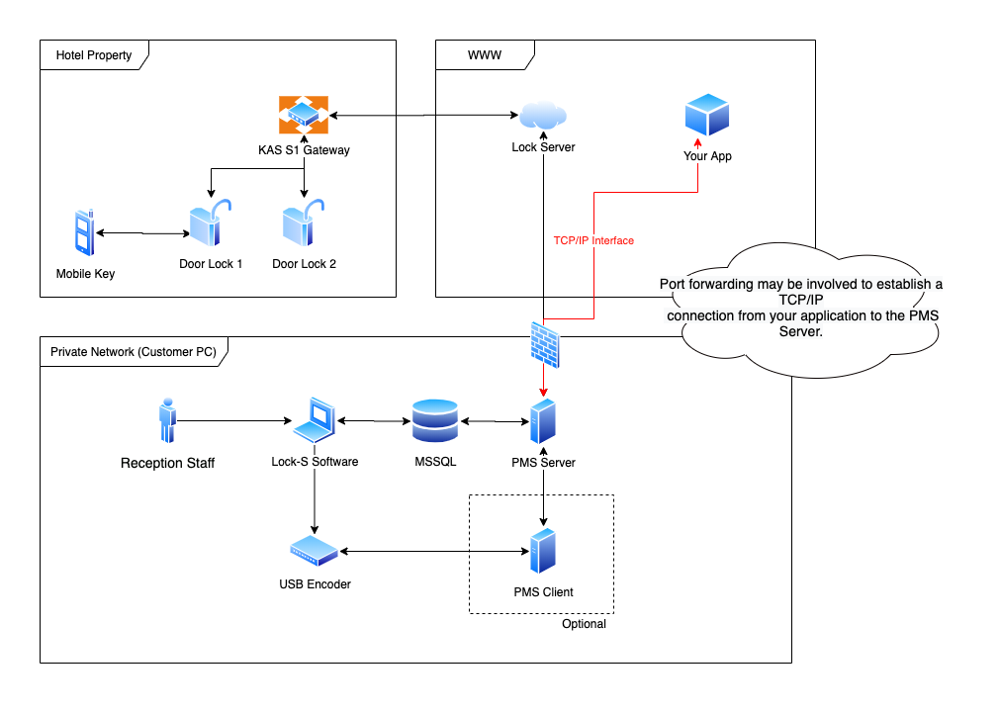
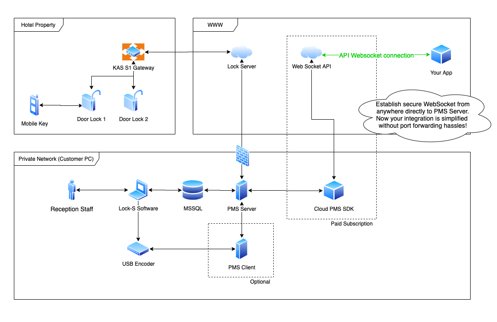

Use the following steps to get started with building an integration with KAS Lock-S Software.

#### Before you start:

[Contact KAS](https://www.kas.com.au) to order your demo locks for development. You will also need a license key and software download link from KAS.


#### Setup the equipment:

[Setup the development environment](/INTEGRATION-PACK/Docs/Development-environment-setup.docx)

1. Install the latest version of Lock-S Software
2. Install the latest version of PMS Server
3. [Optional] install the latest version of PMS Client (for RFID card integrations only!)
4. Setup a lock and gateway by following guides
5. Ensure the lock works by swiping a Master card (Lock-S Software + USB RFID card reader)
6. Ensure the gateway is setup by conducting a Remote Unlock in Lock-S Software

#### Now you can start the integration:

1. Connect to PMS Server by TCP/IP through what host it is running on (such as 172.20.10.7) and port 10003 (See code examples)
2. Observe the PMS Server commands and conduct the Remote Unlock command you did in above steps
3. Replicate this command to remote unlock the door through your TCP/IP integration. Notice the ’R’ to signify room number [(see documentation)](/INTEGRATION-PACK/Docs). R0101A means Room “0101A”. The room number is a string which is the string which was set inside the Lock-S Software during room setup.
4. Follow documentation on the [additional commands](/INTEGRATION-PACK/Docs) and response acknowledgments.
5. [node.js sample code](/Nodejs)
6. [C# sample code](/ConsoleApp3)
7. OR [Cloud PMS SDK](#pms-sdk)

#### [Optional] RFID card integrations

1. Install “PMS Client”
2. Ensure the PMS Server has the PMS client registered (see photos)
3. Now you can conduct the RFID card commands using your TCP/IP Integration.
4. When you send the packets to the PMS Server, it will forward the packets to the PMS Client and program the card. Please ensure you put a blank card on the encoder at this time.
5. Can only program guest cards through PMS interface at this time.

#### Overview Block Diagram:




#### Notes:
- Lock-S Software, PMS Server and MSSQL must be in same network (on the same computer)
- KAS normally setup the Lock-S Software, MSSQL, PMS Server on the customers dedicated computer and sets up the doors for you to interface with.
- It is now up to you to start your integration workflow, here are some options for integration:
  1. Use port forwarding with firewall rules to host your application somewhere else to communicate with the PMS Server for production.
  2. OR host your integration locally next to the PMS Server as a PC app and connect to your own server using HTTPS API. 
  3. OR see [Cloud PMS SDK](#pms-sdk) option below...

#### Minimum Required Software Versions:

- Lock-S Software Version:  V11.0 or above
- PMS Server:               V11.0 or above
- PMS Client:               V9.6 or above


#### Additional Supporting Docs

[Support Knowledge Base](support.kas.com.au)


#### Have questions?

1. First step: [ask KAS](kas.com.au) - they can assist with demo lock setup and all things Lock-S Software & PMS server.
2. Second step: [create an issue on this repo](https://github.com/joshuaheslin/kas-lock-s-integration-sdk/issues) and the contributor will endeavour to answer it promptly.


#### Final words

This is the end of the instructions to build your *own* TCP/IP connection interface to Lock-S Software. If you want to integrate to the application but not able to port forward, just use the [Cloud PMS SDK](#pms-sdk).

<hr>

## <a name="pms-sdk"></a> Cloud PMS SDK

Want an easier way to integrate with Lock-S Software? Continue reading...

The Cloud PMS SDK is an cloud connector between your application and the PMS Server. It means you can open a secure websocket from anywhere and communicate with PMS Server over Websockets. 

It acts as a live relay service or proxy which takes out the TCP/IP socket burden and you can just developer directly against a websocket from anywhere.


### FAQS

#### What is the pain point?

- Your solution is in the cloud and how do you keep track of customers Public IP, port forwarding details etc to open a connection with the PMS Server? 
- Don't have access to the customer private network settings, so I can't setup any port forward rules
- I don't have time to build and deploy a local PC application to connect to PMS Server which polls back to my own HTTP service. 

#### What is it good for?

- Integrations which are cloud based and have no private networking layers or access to modify these layers


#### What is it bad for?

- If you are good at building a local PC application, consider this approach instead. This will save on your Cloud PMS SDK subscriptions fees/costs.

- If you have good control of customers networking and can easily use port forwarding, consider the port forwarding approach instead.

#### Why does it cost money?

- The solution is hosting the web socket API so theres an ongoing cloud hosting fee. This hosting is necessary to complete the entire SDK solution to make it easier for the integrator/developer.

### Diagram

- The solution has two moving parts:
  1) Cloud PMS SDK App - Local PC Application which connects to PMS Server and forwards/receives all TCP/IP traffic that is receives from the Web Socket Api.
  2) Web Socket Api - a cloud hosted infrastructure which connects your application and proxies all requests to Cloud PMS SDK App and PMS Server.



### Pricing

Production: a monthly fee which is paid by the hotel/customer.

Developers: No cost at all. Note: after 30 days of inactivity, the solution infrastructure will be teared down.


### Sample requests

1) Connect to websocket. Example shows connecting by command line but in practise it would be done by your server/browser.

```
$ wscat -c ws://demo.company.com/hotel
Connected (press CTRL+C to quit)

< { "action": "SendMessage", "data": "<write_data_here>" }
> <read_response_here>

< { "action": "SendMessage", "data": "9800O|R0102|UAdmin" }
< 00980|J{“ack”:0,”cmdId”:”5dasdfxxxx”}

< { "action": "SendMessage", "data": "9800C|R0103|UBill" }
< 00980|J{“ack”:0,”cmdId”:”5dasdfxxxx”}

> Connection timeout
```

2) Send the packet of data as a json object for each command:

      `action` : always use `"SendMessage"`

      `data` : this is the TCP/IP data that the PMS Server expects. See documentation for what to use here.

3) The connection will timeout after 10mins automatically. Ensure to reconnect everytime you go to make the command.

### Sample Commands

- Remote Unlock: `9800O|R0102|UAdmin` - Unlocks door "0102"
- Send Mobile Key: `9800I|R0102|NBill|D202012312399|O202012312399|H+61412345678` - Sends mobile key for room "0102" between start YYYYMMDDhhmm and end YYYYMMDDhhmm to mobile number +61412345678 with name "Bill"
- Checkout Mobile Key: `9800B|H+61412345678` - Will invalidate mobile key for number +6142345678
- Program RFID Card: `0103I|R103A|NBob|D202012201200|O202012302100` Program guest RFID card for Bob in room "103A"

### Try it out now!

The beta version of the PMS SDK is ready for developers to integrate.


### Contact

If you're interested in evaluating the PMS SDK, contact this contributor on this repo and it can be setup quite quickly.

